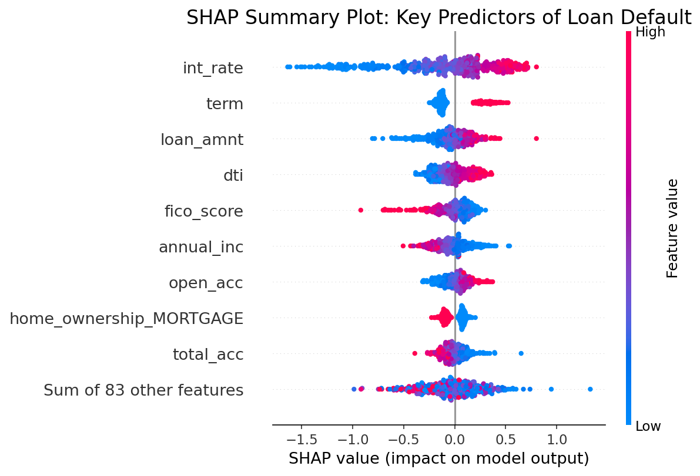

# 💰 DataCents: Decoding Financial Patterns

[](https://github.com/MIT-Emerging-Talent/ET6-CDSP-group-15-repo)
[](LICENSE)
[](https://www.python.org)
[](https://jupyter.org)
[](https://git-scm.com)


## 🔍 Key Takeaway

After exploring millions of loan records from Lending Club, we found that people
with higher interest rates, lower credit scores (FICO), and worse loan grades are
way more likely to default. Among the models we tested, XGBoost worked best at
predicting this, with a ROC AUC of 0.72 — not perfect, but pretty solid.

---

## About Our Team

**DataCents** is a collaborative research team using data science to decode
credit risk in peer-to-peer (P2P) lending platforms.

We apply machine learning and interpretability tools to large-scale lending data
to identify the strongest predictors of loan default. Our goal is to improve
credit assessment, inform smarter lending decisions, and enhance investor
confidence in the evolving alternative finance ecosystem.

---

### Our Mission

[](https://github.com/MIT-Emerging-Talent/ET6-CDSP-group-15-repo)

We are on a mission to:

- Build an open, data-driven framework for assessing default risk in P2P
  lending.
- Identify borrower and loan traits most predictive of default.
- Apply interpretable machine learning to improve credit assessment.
- Support investors, platforms, and regulators with transparent risk insights.

## Research Aim

Our aim is to uncover the key drivers of default risk in P2P lending systems.
Using historical data from Lending Club, we analyze borrower behavior, loan
characteristics, and repayment outcomes to predict risk.

We train models that balance accuracy with explainability, enabling decisions
that are both data-backed and transparent. The ultimate goal is to build tools
that help platforms and investors reduce risk and improve outcomes.

---

## Problem Statement

- P2P platforms offer flexible credit access to millions, yet face a persistent
  challenge: borrower default. Unpaid loans hurt investors, threaten platform
  stability, and erode trust in digital finance.

- Conventional credit scoring may miss key behavioral signals. Many borrowers,
  especially younger users, accumulate invisible debt across platforms. Without
  reliable models, lenders can't detect risk early or fairly.

- By studying a large dataset of loan records and repayment history, we aim to
  reveal the hidden indicators of credit default risk and build interpretable
  models for real-world risk prediction.

### Research Question

> **What are the key borrower and loan characteristics that best predict default
> risk in peer-to-peer (P2P) lending platforms in the United States?**

### 🔍 Modeling the Research Question

To address our research question, we analyze Lending Club data to identify the
borrower and loan features that best predict default risk.

Our modeling approach includes the following stages:

- **Data Cleaning**: Filter loans with known outcomes, remove anomalies, and
  handle missing values for consistent analysis.

- **Feature Engineering**: Create meaningful variables from raw data, such as
  debt-to-income ratios, credit history flags, and loan grade scores.

- **Exploratory Analysis**: Visualize patterns of default by borrower
  demographics, loan purpose, FICO ranges, and installment size.

- **Modeling Techniques**: Use classification models like  
  Logistic Regression, Random Forest, and XGBoost to estimate default
  likelihood.

- **Interpretability Tools**: Apply SHAP analysis and feature importance methods
  to explain model decisions and highlight key predictors.

- **Validation**: Evaluate models with train-test splits and performance metrics
  (AUC, accuracy, recall) to ensure generalizability and robustness.

---

## 📁 Datasets Used

All datasets are stored in our
[`/1_datasets/`](https://github.com/MIT-Emerging-Talent/ET6-CDSP-group-15-repo/tree/main/1_datasets)
folder. Cleaning and preparation scripts are in
[`/2_data_preparation/`](https://github.com/MIT-Emerging-Talent/ET6-CDSP-group-15-repo/tree/main/2_data_preparation).

The primary dataset used in our analysis is the Lending Club loan dataset, which
includes over 2 million loans with borrower traits and repayment outcomes.

Key Features:

- Borrower: employment length, income, FICO score
- Loan: amount, term, purpose, interest rate
- Credit history: earliest credit line, open accounts, delinquencies
- Outcome: loan status (fully paid, charged-off)

## 👥 Meet the Team

<!-- markdownlint-disable MD033 -->
<div align="center">
  <table>
    <tr>
      <td align="center">
        <a href="https://github.com/NoorelsalamAlmakki">
          
          <br/>
          <b>Noorelsalam Almakki</b>
        </a>
        <br/>
        <a href="https://github.com/NoorelsalamAlmakki">
          
        </a>
      </td>
      <td align="center">
        <a href="https://github.com/MadiMalik">
          
          <br/>
          <b>Madiha Maikzada</b>
        </a>
        <br/>
        <a href="https://github.com/MadiMalik">
          
        </a>
      </td>
      <td align="center">
        <a href="https://github.com/MyatCharm">
          
          <br/>
          <b>Myint Myat Zaw</b>
        </a>
        <br/>
        <a href="https://github.com/MyatCharm">
          
        </a>
      </td>
    </tr>
    <tr>
      <td align="center">
        <a href="https://github.com/AhmedKhalifa7">
          
          <br/>
          <b>Ahmed Hussein</b>
        </a>
        <br/>
        <a href="https://github.com/AhmedKhalifa7">
          
        </a>
      </td>
      <td align="center">
        <a href="https://github.com/AlhassenSabeeh">
          
          <br/>
          <b>Al-Hassan Sabeeh</b>
        </a>
        <br/>
        <a href="https://github.com/AlhassenSabeeh">
          
        </a>
      </td>
      <td align="center">
        <a href="https://github.com/dadishimwe">
          
          <br/>
          <b>Dadi Ishimwe</b>
        </a>
        <br/>
        <a href="https://github.com/dadishimwe">
          
        </a>
      </td>
    </tr>
  </table>
</div>
<!-- markdownlint-enable MD033 -->

## 🔍 Research Focus

Our project explores the intersection of behavioral finance and machine
learning, with a focus on peer-to-peer (P2P) credit risk prediction. We aim to:

- Identify key borrower and loan features linked to default outcomes
- Build predictive models using Lending Club loan performance data
- Analyze behavioral and demographic traits influencing credit risk
- Apply feature importance tools to surface critical default indicators
- Support fairer, data-driven credit assessment in alternative lending

## 🛠️ Technical Stack

[](https://www.python.org)
[](https://pandas.pydata.org)
[](https://numpy.org)
[](https://scikit-learn.org)
[](https://matplotlib.org)

## 📁 Project Structure

Our repository is organized into key sections:

- `/0_domain_study/` - Financial domain research and background
- `/1_datasets/` - Financial datasets and market data
- `/2_data_preparation/` - Data cleaning and preprocessing scripts
- `/3_data_exploration/` - Initial data analysis and visualization
- `/4_data_analysis/` - Advanced analysis and modeling
- `/5_communication_strategy/` - How we share our findings
- `/6_final_presentation/` - Final project presentation

### 🌐 Explore Our Project Online

We also built an interactive project website where you can explore our findings,
visualizations, and methodology in a more accessible format.  
👉 **Visit here:** [DataCents Project Website](https://dadishimwe.github.io/datacents/)

## 🚀 Getting Started

1. Clone and setup

   ```bash
   # Clone the repository
   git clone https://github.com/MIT-Emerging-Talent/ET6-CDSP-group-15-repo.git
   cd ET6-CDSP-group-15-repo

   # Create environment
   conda env create -f environment.yml
   conda activate datacents

   # Or install manually
   pip install -r requirements.txt
   ```

2. Start exploring

   ```bash
   # Launch Jupyter Notebook
   jupyter notebook
   ```

Navigate to the `4_data_analysis` directory to begin exploring our financial
data analysis.

## 📈 Project Progress

[](https://github.com/MIT-Emerging-Talent/ET6-CDSP-group-15-repo)

## 📈 Key Findings

Our analysis of the Lending Club dataset reveals significant predictors of loan
default. By employing a suite of machine learning models, we've identified key
financial and behavioral traits that signal heightened credit risk.

### 🆕 Additional Features

#### Risk Score Notebook

In addition to the core analysis, we developed a **Risk Score** feature in the  
[`risk_scoring.ipynb`](4_data_analysis/notebooks/risk_scoring.ipynb)
notebook. This tool calculates a custom risk score for each borrower using the
trained model outputs and key predictive features, helping to quickly flag
high-risk loans.

### Model Performance

We trained and evaluated three classification models to predict loan default.
The models were optimized to handle class imbalance, ensuring that the minority
class (defaulted loans) was given appropriate weight. XGBoost emerged as the
top-performing model, demonstrating the best balance of precision and recall.

| Model               | ROC | Prec (Def) | Rec (Def) | F1 (Def) |
|---------------------|:---:|:----------:|:---------:|:--------:|
| **XGBoost**         |.72  |   0.32     |   0.67    |  0.44    |
| Logistic Regression |.71  |   0.31     |   0.67    |  0.43    |
| Random Forest       |.71  |   0.55     |   0.06    |  0.10    |

_Performance metrics are reported on the test set._

### Key Predictors of Default

Feature importance analysis using both Random Forest and XGBoost, complemented
by SHAP (SHapley Additive exPlanations) values from the XGBoost model,
highlighted several critical factors in predicting loan defaults. The most
influential features include:

- **Interest Rate (`int_rate`):** Higher interest rates are strongly correlated
  with a higher probability of default. This is often the most significant
  predictor.
- **Loan Grade and Sub-Grade:** The assigned loan grade (A-G) by the platform is
  a powerful indicator of risk, with lower grades showing much higher default
  rates.
- **FICO Score (`fico_score`):** As expected, lower FICO scores are a primary
  indicator of credit risk.
- **Debt-to-Income Ratio (`dti`):** Borrowers with a higher percentage of their
  income going towards debt payments are more likely to default.
- **Annual Income (`annual_inc`):** Lower annual income is associated with a
  higher risk of default.
- **Loan Amount (`loan_amnt`):** Larger loan amounts can represent a higher
  risk.

### Visualizing Risk Factors

To better understand the model's decisions, we used SHAP summary plots. These
visualizations show the impact of each feature on the prediction for individual
loans. For example, a high interest rate pushes the prediction towards default,
while a high FICO score pushes it towards repayment.

This provides a transparent view into our model, allowing for interpretable,
data-driven lending decisions. Our findings can help investors and platforms
better assess risk and improve outcomes in the P2P lending market.



_The SHAP summary plot above shows the impact of the top features on the model's
output. Each point represents a single loan from the test set. The color
indicates the feature's value (red is high, blue is low), and the position on
the x-axis shows the feature's impact on the default prediction._

---

### ⚠️ Limitations

- The data is from 2007–2018, so a lot has changed since then (especially after COVID).
- There’s still class imbalance — even with reweighting, predicting default is hard.

---

### 🔭 What Could Be Done Next

- Try time-series models to predict default earlier in the loan cycle.
- Test the model on more recent data or on another P2P platform.
- Study if the models show bias (e.g., by demographic).
- Build a web tool or dashboard for lenders to test real loans.

---

## 🤝 Contributing

We welcome contributions! Please see our [CONTRIBUTING.md](CONTRIBUTING.md) for
guidelines.

## 📝 License

This project is licensed under the MIT License - see the [LICENSE](LICENSE) file
for details.

---

[](https://github.com/MIT-Emerging-Talent/ET6-CDSP-group-15-repo)

> _"The goal is to turn data into information, and information into insight." -
> Carly Fiorina_

Join us as we make sense — and DataCents — out of information.
